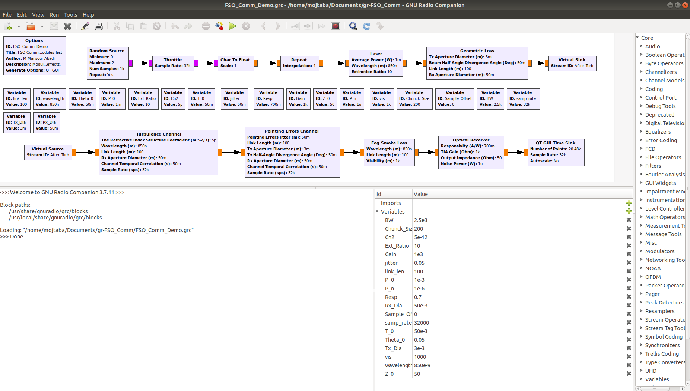
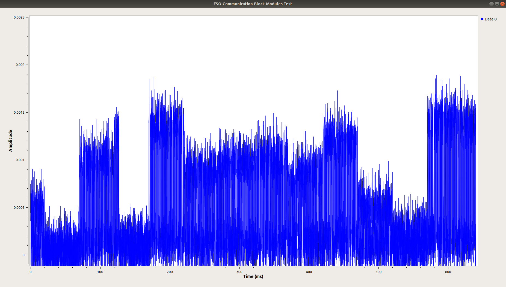
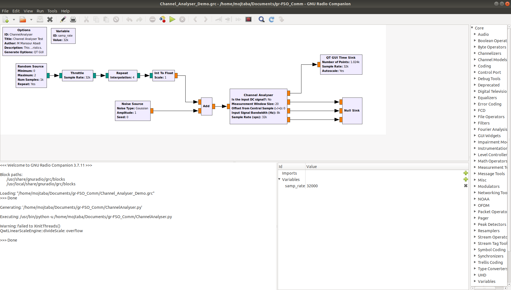
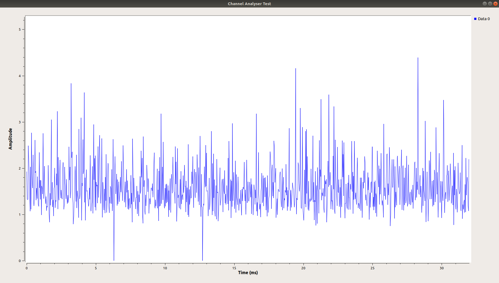

# FSO-GnuRadio-Module
A module for simulating free-space optical communication systems using GnuRadio

To compile the module:
- create ./build directory,
```
cd Build
cmake ../
make
```

- go to /build folder,
```
  make test
```

- go to /build folder,
```
sudo make install
sudo ldconfig
```

Check the demo files included in the repository for further information and usage example:

### FSO_Comm_Demo.grc



### Channel_Analyser_Demo.grc


